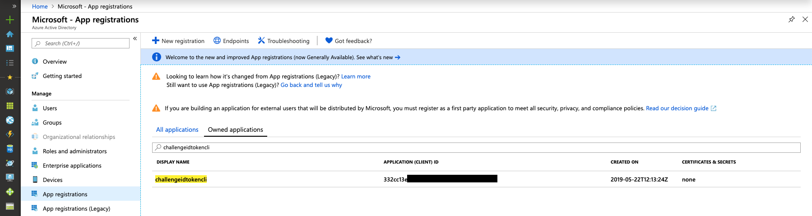

# Receive an ID Token from AAD

## Here is what you'll learn

- How to register an AAD application
- How to create an `OpenIdConnect` request to authenticate an user
- How to receive an ID token to get information about the authenticated user

## Create an AAD application

Before you can authenticate an user you have to register an application in your AAD tenant.
You can either use the PowerShell Module Az or Azure CLI.

### PowerShell

``` Powershell
New-AzADApplication -DisplayName ChallengeIdToken -IdentifierUris https://challengeidtoken -ReplyUrls http://localhost:5001/api/tokenecho
```
Retrieve the ID of your current AAD tenant via:

``` Powershell
Get-AzContext
```

### Azure CLI

```Shell
az ad app create --display-name challengeidtokencli --reply-urls http://localhost:5001/api/tokenecho --identifier-uris https://challengeidtoken
```

Retrieve the ID of your current AAD tenant via:

```Shell
az account show 
```

### Viewing your ApplicationId

Note the `appId` value in the response - this is the id under which your AAD application has been registered.

In the Azure Portal, you can see your new app registration under `AAD --> App Registrations --> Owned applications`:



## Run the Token Echo Server

Open another shell and run the Token Echo Server from [`apps/token-echo-server`](apps/token-echo-server) in this repository. This helper ASP.NET Core tool is used to echo the token issued by your AAD. The tool is listening on port 5001 on your local machine. Tokens are accepted on the route `http://localhost:5001/api/tokenecho`. this is why we initially registered an AAD application with a reply url pointing to `http://localhost:5001/api/tokenecho`.

```
dotnet run
```

## Create an authentication request

Replace `TENANT_ID` with your TenantId and `APPLICATIONID` with your ApplicationId. Open a browser and paste the modified request.

```
// Line breaks are for readability only

GET
https://login.microsoftonline.com/TENANT_ID/oauth2/v2.0/authorize?
client_id=APPLICATION_ID
&response_type=id_token
&redirect_uri=http%3A%2F%2Flocalhost%3A5001%2Fapi%2Ftokenecho
&response_mode=form_post
&scope=openid%20profile
&nonce=1234
```

Copy the `id_token` value from your browser output, go to [https://jwt.ms](https://jwt.ms) and paste the token. Take a minute and have a look at the decoded token.

If you need further information about the issued claims take a look [here](https://docs.microsoft.com/en-us/azure/active-directory/develop/id-tokens#header-claims).

## Cleanup resources

### PowerShell

```Powershell
Remove-AzAdApplication -ApplicationId <applicationid> -Force
```

### Azure CLI

```Shell
az ad app delete --id <applicationid>
```

## Summary

This challenge showed how to create an new application in AAD and how an `OpenIdConnect` request is created to authenticate an user.