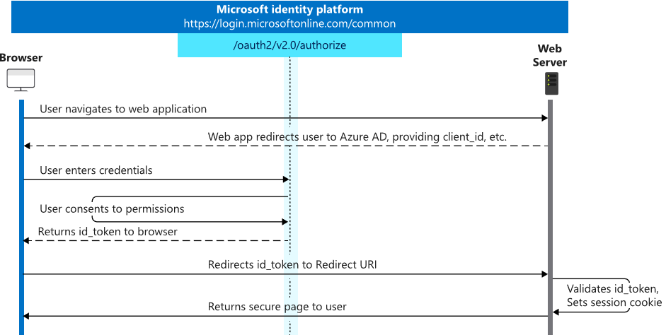

# Authenticate users in a web app using Azure AD

## Here is what you'll learn

- How to register an application in AAD
- How to authenticate users in a ASP.NET Core MVC application
- How to receive an `id_token` with basic profile information about the authenticated user

In contrast to the last challenge, this time we'll have a "real website" running, to show how the process of the Open ID Connect protocol looks in a real application.

## Description

In this challenge we create a simple ASP.NET Core MVC Application that uses Azure AD to authenticate users.
The sample application can be found under [`apps/aspnetcore-mvc-oidc-idtoken`](apps/aspnetcore-mvc-oidc-idtoken) in this repository.

The following picture demonstrates the authentication flow:



Same as in challenge 0, we forward our user to the `/oauth2/v2.0/authorize` path and have him or her sign-in. When the `id_token` is received via the callback to the web application, a session cookie is created that contains the `id_token`. Each additional call sends the cookie to the server so that the server can validate the `id_token` and check if it is still ok.

Each ASP.NET Core controller uses the [Authorize](https://docs.microsoft.com/en-us/aspnet/core/security/authorization/simple?view=aspnetcore-2.2) attribute to indicate that the controller's methods can only be invoked by an authenticated user.

In the previous [challenge](challenge-0-oidc-idtoken.md) a token echo server was used to receive the `id_token` from Azure AD. In our ASP.NET Core website, a special route `/signin-oidc` is created to handle the post back/call back from Azure AD containing the `id_token`.
We have to use this route as the reply url when we create the Azure AD application for the demo ASP.NET Core MVC application. The demo is listening on port 5002.

## Create the Azure AD application

As before, we need to register an application with Azure AD.

### PowerShell

```powershell
New-AzADApplication -DisplayName ChallengeIdTokenAspNet -IdentifierUris https://challengeidtoken -ReplyUrls http://localhost:5002/signin-oidc
```

Note down the `ApplicationId` from the response.

### Azure CLI

```shell
az ad app create --display-name ChallengeIdTokenAspNet --reply-urls http://localhost:5002/signin-oidc --identifier-uris https://challengeidtoken
```

Note down the `appId` from the response.

## Configure the application

Open the `appsettings.json` in [`apps/aspnetcore-mvc-oidc-idtoken`](apps/aspnetcore-mvc-oidc-idtoken) and replace values:
* `Domain` -> your domain e.g., `mycompany.onmicrosoft.com`
* `TenantId` -> your Azure AD Directory Id (also known as Tenant Id)
* `ClientId` -> `ApplicationId` of the newly created application

## Run the application

Open a shell and navigate to the [`apps/aspnetcore-mvc-oidc-idtoken`](apps/aspnetcore-mvc-oidc-idtoken) folder. Run the application via:

```shell
dotnet run
```

Open a browser and navigate to [`http://localhost:5002`](http://localhost:5002).

## Cleanup resources

### PowerShell

```powershell
Remove-AzAdApplication -ApplicationId <applicationid> -Force
```

### Azure CLI

```shell
az ad app delete --id <applicationid>
```
