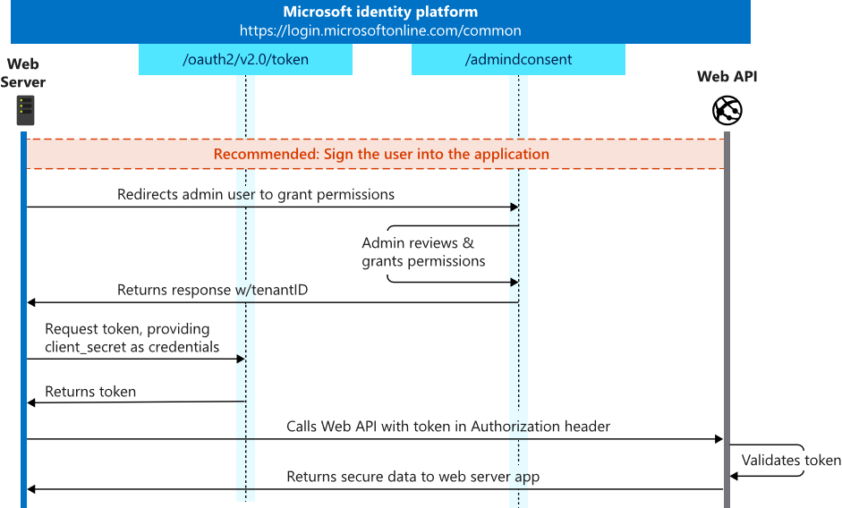

# OAuth2 client credentials flow

## Here is what you will learn

- How to register an Azure AD application and request permission to access protected resources on-behalf of the application
- How to call the consent page for an Azure AD administrator to grant needed application permissions

The Client Credentials Flow is used to access protected Azure AD resources by using the identty of an application. This type of grant is commonly used for server-to-server interactions that must run in the background, without immediate interaction with an user. These types of applications are often referred to as daemon or service accounts.
The OAuth 2.0 client credentials grant flow permits a web service (confidential client) to use its own credentials, instead of impersonating a user, to authenticate when calling another web service. In this scenario, the client is typically a middle-tier web service, a daemon service, or a web site. For a higher level of assurance, the Microsoft identity platform also allows the calling service to use a certificate (instead of a shared secret) as a credential.

The following picture demonstrates the authentication flow:



### Recommended: Sign the user into your app
Typically, when you build an application that uses application permissions, the app requires a page or view on which the admin approves the app's permissions. This page can be part of the app's sign-in flow, part of the app's settings, or it can be a dedicated "connect" flow. In many cases, it makes sense for the app to show this "connect" view only after a user has signed in with a work or school Microsoft account.

### Request the permissions from a directory administrator
When you're ready to request permissions from the organization's admin, you can redirect the user to the admin consent endpoint.

```HTTP
GET https://login.microsoftonline.com/{tenant}/adminconsent?
client_id={appid}
&state=12345
&redirect_uri=http://localhost/myapp/permissions
```

## Scenario:
In this challenge we create an Azure AD application that requests permissions to Microsoft Graph API to read all users on-behalf of the application.

## Create the Azure AD application

// Todo