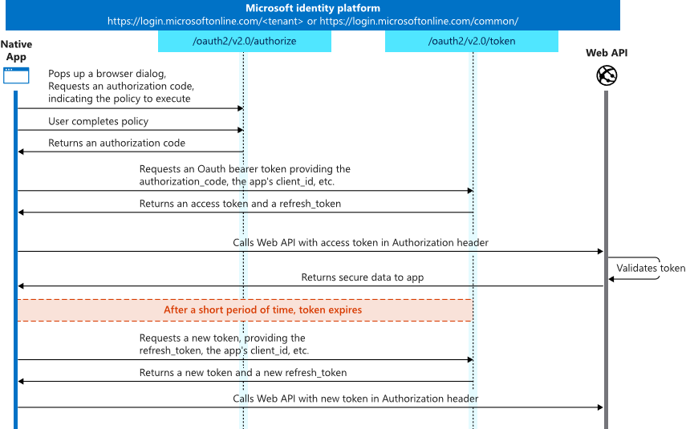

# Create an API that is protected by Azure AD

## Here is what you learn
- Create a REST API that is protected by Azure AD
- Create an Azure AD application for your REST API
- Integrate authorization in Swagger for your API 
- Use the OAuth2 auth code grant to acquire an access token from a client to call your REST API
- Dynamically grant consent to read signed-in user's profile

## Protocol diagram
At a high level, the entire authentication flow for a native/mobile/webapp looks a bit like this:



To protect an API with Azure AD an Azure AD application for the API must be created.
An API does not sign in users, therefore no reply url must be created when the Azure AD application is registered.

## Sample scenario
A sample scenario is already implemnted for this challenge. The sample contains a web API that is running on ASP.NET Core which is protected by Azure AD. The web API is accessed by an ASP.NET Core web application on behalf of the signed-in user. The ASP.NET Core Web application uses the OpenID Connect middleware and MSAL for .NET to acquire an access token for the API on behalf of the signed-in user.
The sources for the sample application is located here:
[aspnetcore-protect-api](/apps/aspnetcore-protect-api)

## Create the Azure AD applications

To create the Azure AD applications we use Powershell and the AzureAD module.
The API is running on port 5002 and the Web application is running on port 5003.

Connect to AzureAd Instance:

```powershell
Connect-AzureAD
```

### Step 1: Register an Azure AD Application for the API
To expose an API application in AzureAD OAuth 2.0 permission scopes must be exposed.
When creating an Azure AD application using New-AzureADApplication Cmdlet a scope named "user_impersonation" is created automatically.
If further scopes must be created, use the following:

```Powerhsell
$exposedScopes = New-Object -TypeName Microsoft.Open.AzureAD.Model.OAuth2Permission
$exposedScopes.Type = "User"
$exposedScopes.AdminConsentDisplayName = "AccessEcho Claims API"
$exposedScopes.AdminConsentDescription = "Access Echo Claims API on behalf of signed-in users to echo claims."
$exposedScopes.Id = $(New-Guid)
$exposedScopes.IsEnabled = $true
$exposedScopes.Value = "myscope"
$exposedScopes.UserConsentDisplayName = $null
$exposedScopes.UserConsentDescription = $null
```

Create the Azure AD application for the API.

```powershell
$api = New-AzureADApplication -DisplayName "EchoClaimsAPI" -IdentifierUris "https://echoclaimsapi"
```

Do the following when further scopes must be created.

```powershell
$api = New-AzureADApplication -DisplayName "EchoClaimsAPI" -IdentifierUris "https://echoclaimsapi" -Oauth2Permissions $exposedScopes
```

Create a ServicePrincipal for the application

```powershell
New-AzureADServicePrincipal -AppId $api.AppId
```


### Step 2: Register an Azure AD application for the Web application

```powershell
# Create the Azure AdApplication
$app = New-AzureADApplication -DisplayName EchoClaimsWebApp -IdentifierUris "https://echoclaimswebapp" -ReplyUrls "http://localhost:5003/signin-oidc"
```

To acquire an access token for the API we use the OAuth2 code grant flow, therefore we need a client secret.

```powershell
$secret = New-Guid
New-AzureADApplicationPasswordCredential -ObjectId $app.ObjectId -CustomKeyIdentifier "ClientSecret" -Value $secret
```

Create a ServicePrincipal for the application

```powershell
New-AzureADServicePrincipal -AppId $app.AppId
```

## Run the demo application

In the demo application the ASP.NET Core web application calls the ASP.NET Core API which just returns the claims of the calling user.
The demo is located [here](/apps/aspnetcore-protect-api)
To run the demo application two shells must be opened, one for the web application and one for the API.

### Run the API
Edit the file [appsettings.json](apps/aspnetcore-protect-api/WebApi/appsettings.json) and replace Domain, TenantId, and ClientId.

In the shell navigate to the folder /apps/aspnetcore-protect-api/WebApi and run the following dotnet command

```shell
dotnet run
```
The API is listening on port 5002.

### Run the Web application
Edit the file [appsettings.json](apps/aspnetcore-protect-api/WebApplication/appsettings.json) and replace Domain, TenantId, ClientId and ClientSecret.

In another shell navigate to the folder /apps/apsnetcore-protect-api/WebApplication and run the following dotnet command.

```shell
dotnet run
```
The web application is listening on port 5003.

Open a browser and navigate to http://localhost:5003 and sign in.
Azure AD will ask you if you want to grant consent for application permissions.
After you have granted consent to access EchoClaims API click the link "GetClaims".
The claims for the signed-in user will be displayed.

Now, try to click the link "GetUserProfile". As you didn't grant consent to access full user's profile the application needs to be redirected to Azure AD to gain consent to access
the full profile of the user.

Take a look at the implementation of the [HomeController](apps/aspnetcore-protect-api/WebApplication/Controllers/HomeController.cs).
The method "GetUserProfile" tries to get the full profile of the signed-in user. In the catch statement the controller redirects to "Home/ConsentRequried" if an exception of type MsalUiRequiredException is thrown.
The View [ConsentRequired](apps/aspnetcore-protect-api/WebApplication/Views/Home/ConsentRequired.cshtml) informs the user that he must be redirected to Azure AD to grant consent to access the profile of the signed-in user. In the [AccountController](apps/aspnetcore-protect-api/WebApplication/Controllers/AccountController.cs) the method "GrantConsent" redirects the user to Azure AD to grant consent.