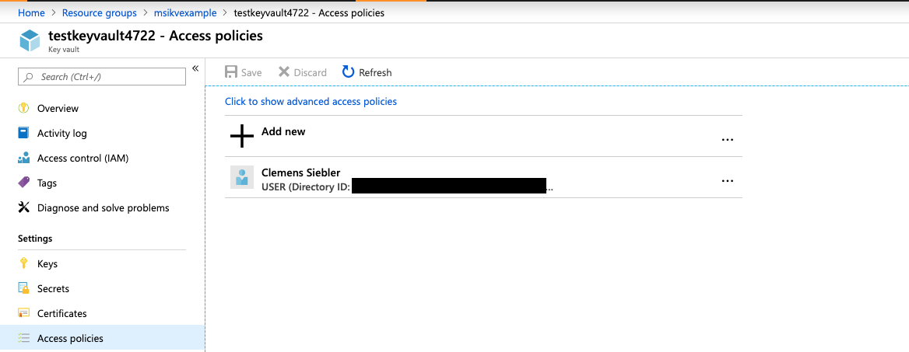
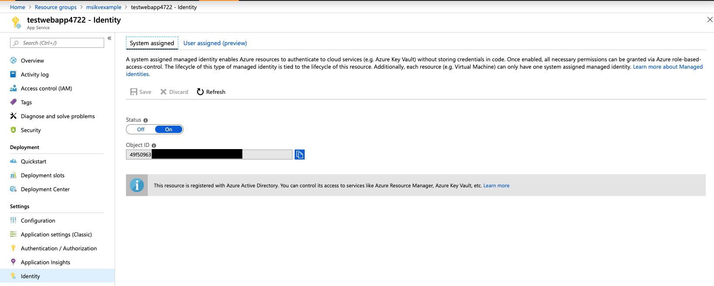
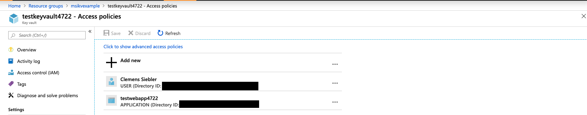

# Use Managed Identity to authenticate to Key Vault

## Here is what you'll learn
- Create a Key Vault that stores your secrets
- Leverage Managed Identity for only allowing specific Azure resources to access the secrets in the Key Vault
- How to avoid storing secrets anywhere (except in Key Vault :raised_hands:)

## Managed Identity

Managed Identity is basically an AD user, that is directly tied to a resource. It can be used to allow certain Azure resources access other Azure resources without authentication. Example: a VM or an App Service accessing a Key Vault instance or an Storage Account.

***Note***:
`Managed identities` for Azure resources is the new name for the service formerly known as `Managed Service Identity (MSI)`.

### Types of Managed Identities

* `System-assigned Managed Identity`
  * Directly enabled on an "managed-identity-enabled" Azure service itself
  * Automatically creates an identity in the Azure AD tenant
  * Credentials live on the Azure service instance
  * Lifecycle is tied to the lifetime of the Azure service and is automatically deleted

* `User-assigned Managed Identity`
  * Standalone Azure resource
  * Lives as identity in the Azure AD tenant
  * Can be assigned to multiple Azure resources
  * Lifecycle is not tied to the lifecycle of the used resources

More information can be found [here](https://docs.microsoft.com/en-us/azure/active-directory/managed-identities-azure-resources/overview).

### Why services can have a Managed Identity?

Most "compute-related" services (e.g., VMs, App Service, Functions, etc.) support hosting a Managed Identity, an a full list can be found [here](https://docs.microsoft.com/en-us/azure/active-directory/managed-identities-azure-resources/overview#how-can-i-use-managed-identities-for-azure-resources).
Many services that are often accessed by a "compute-related" service allow for automatic authentication via Managed Identities, such as e.g., Key Vault, Data Lake, Azure SQL, Resource Manager, Azure Storage, and a few more.

## Create a Key Vault

First, we create a Key Vault instance:

```console
az group create -n msikvexample -l westeurope
az keyvault create --location westeurope --name testkeyvault4722 --resource-group msikvexample
```

If we check the `Access Policy` tab for our Key Vault in the Azure Portal, we can see that we have full access control over the Key Vault, meaning we can fully managed secrets (create, read, update and delete).



We can also add the `--no-self-perms` parameter to avoid us getting added to the Key Vault.

## Create a Web App

Second, we'll create a Web App, on which we'll enable Managed Identity:

```console
az appservice plan create --name myplan --resource-group msikvexample --sku S1
az webapp create --name testwebapp4722 --resource-group msikvexample --plan myPlan
```

Let's enable the Managed Identity:

```console
az webapp identity assign --name testwebapp4722 --resource-group msikvexample
```

We'll get back the `PrincipalId` of the newly created AD tenant "user":

```json
{
  "identityIds": null,
  "principalId": "49f50963-......",
  "tenantId": "72f988bf-......",
  "type": "SystemAssigned"
}
```

If we check the `Identity` tab in our App Service, we should see that Managed Identity has been enabled and also see the associated `PrincipalId`:



Lastly, we can add secrets to our Key Vault:

```console
az keyvault secret set --vault-name testkeyvault4722 --name mysecret1 --value nobodyshouldreadthis
az keyvault secret set --vault-name testkeyvault4722 --name mysecret2 --value nobodyshouldreadthiseither
```

## Connect everything

Let's add the PrincipalId to our Key Vault and give it permission to `get` and `list` secrets:

```console
az keyvault set-policy --name testkeyvault4722 --object-id 49f50963-.... --secret-permissions get list
```

Let's check the `Access Policies` of our Key Vault, and we can see that the `testwebapp4722` has been added:



Lastly, let's give our Web App the URI of our Key Vault:

```console
az webapp config appsettings set --resource-group msikvexample --name testwebapp4722 --settings KEY_VAULT_URI=https://testkeyvault4722.vault.azure.net
```

## Write an application that requires the secrets

Open the provided .NET application under `apps/aspnetcore-managed-identity-key-vault/` in VS Code. Then open `appsettings.Development.json` and replace the `KEY_VAULT_URI` setting with your own Key 
Vault URI.

Next, on an `az cli`-authenticated terminal, run the application:

```console
dotnet run
```

This might take a few seconds to start up, as the application will automatically fallback to your local Azure Service Principal, that is used by the Azure CLI.

In a browser, or using `curl`, access:

```
https://localhost:5001/api/test
```

You should see the two secrets. 

Lastly, we'll push the application to Azure. Here, it will automatically use your Managed Identity to authenticate against the Key Vault.

```console
dotnet publish aspnetcore-managed-identity-key-vault.csproj -c release -o deploy

cd deploy; zip -r -X ../deploy.zip . *; cd ..

zip -rjX deploy.zip deploy/

az webapp deployment source config-zip --name testwebapp4722 --resource-group msikvexample --src deploy.zip
```

Again, visit:

```
https://testwebapp4722.azurewebsites.net/api/test
```

And you should see the two secrets.